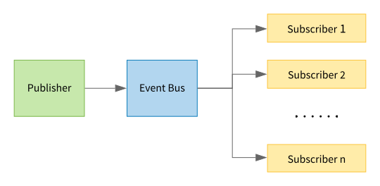
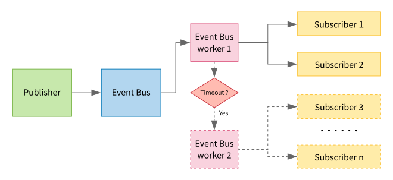

# Event Bus [](https://badge.fury.io/gh/jocelynmass%2Fevent_bus) [](https://opensource.org/licenses/MIT)


Event publisher/subscriber library allowing to reduce code dependencies. Events can be executed from the event bus thread or from a dedicated thread, depending of the subscriber settings.

# Init

- Define event, an event is a uint32_t

```c
enum event_bus_id
{
    EB_EVT1 = 0,
    EB_EVT2,
};
```

- Init Event Bus

```c
void main(void)
{
    eb_t ebus;
    struct app_ctx app;
  
    eb_init(&ebus, &app);
    
    ...
}
```

# Direct API

This API allows to directly notify subscribers from the event bus context. Subscribers will be notified sequentially, meaning timely critical calls can't be ensured as one subscriber can prevent the others to be executed.



Usage:

- Create a subscriber

```c
static int32_t custom_evt1_sub(void *app_ctx, uint32_t event_id, void *data, uint32 len, void *arg)
{
    printf("received evt id = %d\n", event_id);
    return 0;
}

void foo_sub(void)
{
    eb_sub_direct(&ebus, "custom_evt1", EB_EVT1, NULL, custom_evt1_sub);
}
```

- Create a publisher

```c
void foo_pub(void)
{
    eb_pub(&ebus, EB_EVT1, NULL, 0, EVENT_BUS_LOW_PRIO);
}

```

# Indirect API

This API allows to indirectly notify subscribers. Event Bus will create a thread from which the subscribers will be called. In a case a subscriber would consume too much CPU, the remaining subscribers would be defered to a new thread. This would ensure subscribers to be executed in a maximum known latency (EB_MAX_SUB_LATENCY_MS * number of subscribers). eb_pub API now takes a priority flag. It can either be low or high priority. Events published as high priority will take over any other events already queued to event bus.



Usage:

- Create a subscriber

```c
static int32_t custom_evt1_sub(void *app_ctx, uint32_t event_id, void *data, uint32 len, void *arg)
{
    printf("received evt id = %d\n", event_id);
    return 0;
}

void foo_sub(void)
{
    eb_sub_indirect(&ebus, "custom_evt1", EB_EVT1, NULL, custom_evt1_sub);
}
```

- Create a publisher

```c
void foo_pub(void)
{
    eb_pub(&ebus, EB_EVT1, NULL, 0, EVENT_BUS_LOW_PRIO);
}

```

# Passing data to subscribers

eb_pub can take data to be sent to subscribers. Keep in mind that data passed to the publisher is dynamically allocated and freed by event bus.

Usage:

- Create a subscriber

```c
static int32_t custom_evt1_sub(void *app_ctx, uint32_t event_id, void *data, uint32 len, void *arg)
{
    printf("received evt id = %d - len = %d - data = %s\n", event_id, len, char *data);
    return 0;
}

void foo(void)
{
    eb_sub_indirect(&ebus, "custom_evt1", EB_EVT1, NULL, custom_evt1_sub);
}
```

- Create a publisher

```c
void foo(void)
{
    eb_pub(&ebus, EB_EVT1, "hello world", strlen(hello world) + 1, EVENT_BUS_LOW_PRIO);
}
